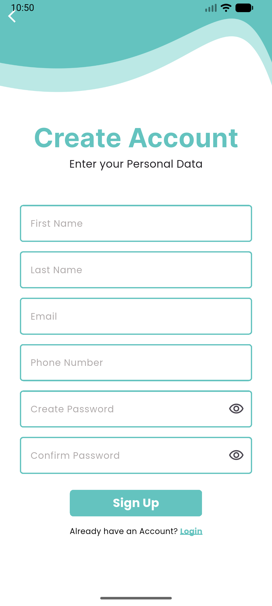
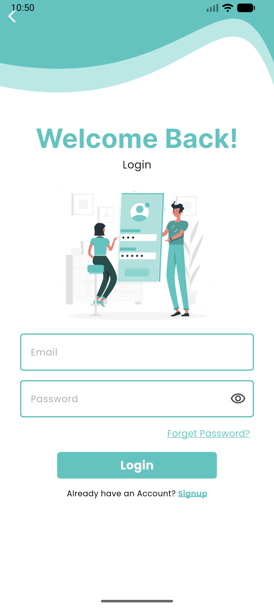

# 📱 Flutter Authentication UI

This is my **first Flutter project**, where I built a simple **authentication user interface** using Flutter.

The project focuses on creating clean UI screens such as:
- Welcome Screen
- Sign Up Screen
- Login Screen

It was created as a **learning project** to practice Flutter layouts, widgets, and navigation.

---

## ✨ Features
- Welcome screen with navigation to Login & Sign Up
- Sign Up form with multiple input fields
- Login screen UI
- Clean UI using custom colors and Google Fonts
- Simple navigation using `Navigator`
- Organized project structure

---

## ⚠️ Notes
- This project focuses on **UI only**
- No backend or authentication logic implemented
- Validation is not fully implemented
- **Not fully responsive** on all screen sizes
- Built mainly for learning and practice purposes

---

## 📱 App Screenshots





---

## 🛠 Tools & Technologies
- Flutter
- Dart
- Material Design
- Google Fonts
- Gap Package

---

## 🚀 Getting Started
1. Clone the repository
2. Run `flutter pub get`
3. Start the app using:
   ```bash
   flutter run
